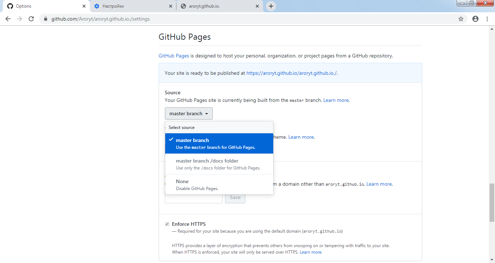

# Відповіді до лб9
1.Щоб сайт мав виглад як у мережі інтернет потрібно зайти у "setting" і знайти пункт "Github PAGES", там ми вибираємо пункт на ресурс нашої гілки

2. Щоб завантажити файли потрібно натиснути на кнопку "Upload files" і далі вибрати потрібні файли

